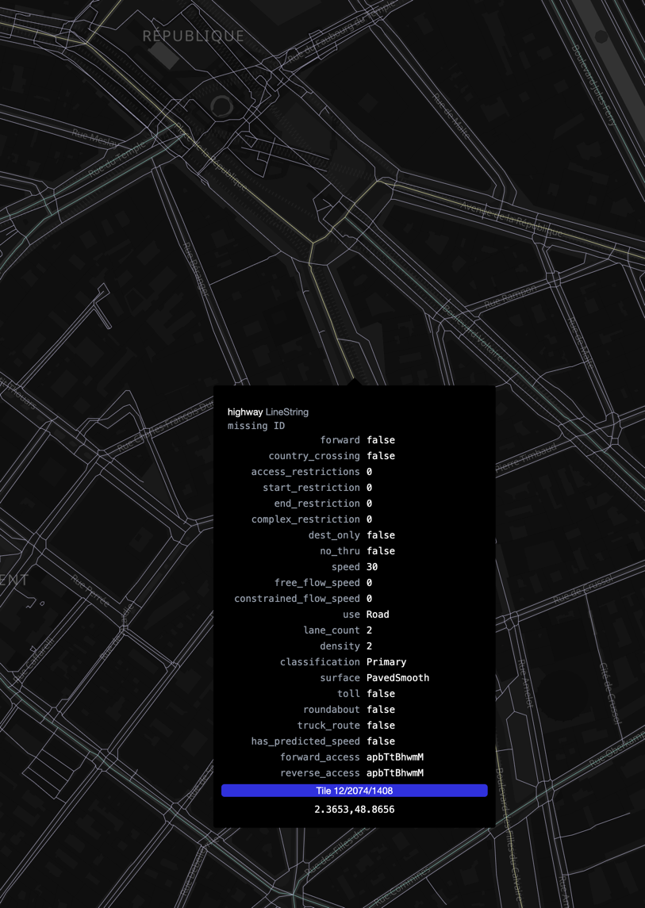

# Edge Exporter

This tool exports data from a Valhalla tile graph.
The intended use case is vector tile generation, so you can inspect a route graph.
We currently accomplish this by dumping to an intermediate format and tiling with tippecanoe.



## Getting graph tiles

Build a graph the way you usually do (docker image etc.).
The Valhalla docs are your guide.
**This tool currently operates on the directory tree directly, not a tarball**.

## Creating JSON from the tiles

Something like this will generate a directory tree of zstd-compressed GeoJSON in another directory.

```shell
cargo run --profile release -- /path/to/valhalla/tiles /path/to/valhalla/tiles-json
```

If you want to skip compression (and write plain newline-delimited GeoJSON with .geojson extension), pass `--no-compress`:

```shell
cargo run --profile release -- --no-compress /path/to/valhalla/tiles /path/to/valhalla/tiles-json
```

Some numbers for context using the UK in February 2025 run on an M1 Max:

* Original OSM PBF size - 1.87GB
* Valhalla tiles (uncompressed) - 2.42GB
* ZSTD compressed GeoJSON - ~560MB
* Time to dump compressed GeoJSON tree - ~90 seconds

### Dense tiles

If compressing the output (recommended for most filesystms unless you have infinite space):

```shell
rm -f valhalla.pmtiles && time find tiles-json/ -type f -name '*.zst' -print0 | xargs -0 zstd -dc | tippecanoe --no-tile-size-limit --no-feature-limit -Z4 -z13 --simplify-only-low-zooms --coalesce --reorder --drop-lines -o valhalla.pmtiles
```

If not compressing the output (ZFS or other filesystems with sane compression):

```shell
rm -f valhalla.pmtiles && time find tiles-json/ -type f -name '*.geojson' -exec cat -- {} + | tippecanoe --no-tile-size-limit --no-feature-limit -Z4 -z13 --simplify-only-low-zooms --coalesce --reorder --hilbert --drop-lines -o valhalla.pmtiles
```

And some more numbers for context (also UK):

* Processing time (started a bit after 17) - ~10 mins
* PMTiles size - ~390MB

You can explore the file using [pmtiles.io](https://pmtiles.io)

### Sparse tiles??

I tried `-at`, which generated much smaller tiles, but it looks like the PMTiles web viewer doesn't handle this well.

```shell
tippecanoe -at -P -o valhalla.pmtiles --extend-zooms-if-still-dropping tiles-json/**.geojson
```

## Open threads

* GeoJSON is a terrible serialization format; it's massively bloated. Can we use something better?
  - Initial passes at this were REALLY problematic, but it compresses well with zstd w/o much perf penalty, so not urgent...
  - Tippecanoe supports FlatGeoBuf, but not GeoParquet
  - Tippecanoe can accept input from stdin, but does it have to read everything? If so, the RAM requirement will be a problem.
  - Could we just dump GeoParquet files and work with those?
    - Would be a heck of a lot better write throughput, and bypass the whole step
    - GeoParquet also supports a wider range of types
    - Could *not* use Tippecanoe effectively AFAIK
    - [parquet-wasm](https://github.com/kylebarron/parquet-wasm) is a thing... looks like a fair bit of work though
    - Something like [this](https://github.com/sfomuseum/go-geoparquet-show)?